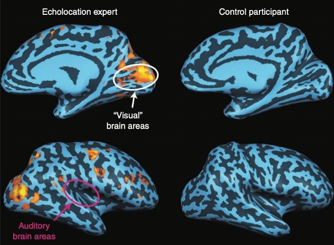
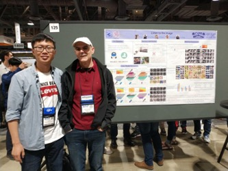
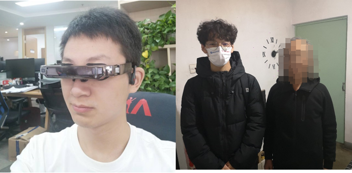

Although this is a difficult task, Assistant Profesor Di Hu and his students of GeWu-Lab are trying to help the visually impaired friends "see" the world again. By chance, Mr. Di Hu met Luis Goncalves, the developer of The vOICe (OIC is "oh! I see") when he attended academic conferences abroad. After some communication, he was deeply moved by Mr. Goncalves as a front-line researcher, the helping behavior to the visually impaired and the sincere desire to benefit the visually impaired. 

Since then, close relationship has been established, and cooperation in this field has driven the improvement of related technologies[1]. Mr. Di Hu noticed that compared with developed countries in the West, there are relatively few organizations to protect the rights and interests of special groups in China. Due to the difference in life and communication scope, the major society does not understand the difficulties and needs faced by the visually impaired friends around them. There is a need for more organizations and individuals devoting abilities and actions to take on social responsibilities, walk into them, understand them, combine science and technology with humanistic care, and implement the dividends of technological progress to those who really need help. 

#### SSD Technology Research—make the visually disabled ‘see’ the world again

Biomedicine and cognitive neuroscience have gradually discovered that there are close connections between different functional areas of the human cerebral cortex, such as the phenomenon of multi-channel perception: when we eat an apple, the brain naturally associates the appearance, aroma, taste, etc. The information comes together to help us get a complete picture of Apple. We know that regardless of the type of external signals, they are captured by the body's receptors and then converted into chemical substances or pulses for transmission in the body. There is no difference in the form of different signals.

Since the main cause of blindness is various eye diseases, most of the visual cortex should be intact. Then maybe there is this possibility: in these areas where there is multi-channel perception, because the different signals have the same form, other signals can also be transmitted in the visual pathway. If other signals are sent to the visual center, the brain also interprets them as images. In other words, a blind person can “make up” an image of a flower by hearing a piece of audio, or "see" an apple by smelling the scent of an apple.

Schematic representation of cerebral cortical activation in a blind and control group capable of echolocation

In fact, there are already many blind people who rely on methods such as tapping on a cane and stomping their feet to echolocate (like bats) to be able to recognize scenes to help them walk. Some scientists have conducted brain MRI studies on blind people who "see" their surroundings through their ears [2]. It was found that when the blind people heard the echolocation recordings, their primary visual cortex was activated, but the auditory cortex was not. And that doesn't happen in ordinary people. This finding provides a strong physiological basis for helping blind people "see" their surroundings through other senses.

Over the past few decades, there have been a number of projects trying to help people with disabilities regain lost senses through other sensory pathways, known as sensory replacement devices. One of the main ones we use is The vOICe.

Di Hu (left) and The vOICe developer Luis Goncalves (right)

#### Social Welfare Practice — make AI repay the society, we are in the way

The goal of the GeWu-Lab is "make AI warm". We hope that technology can truly benefit people's lives and make technology better. We also hope that more and more people will pay more attention to what we are doing, pay attention to the visually impaired, a group that needs help and respect, and can do even a little bit of dedication for them. At present, Mr. Hu Di and his students Xiaokang Peng, Zhaoyang Yu, Yake Wei have established cooperation with organizations such as the Beijing Disabled Persons' Foundation, and contacted several visually impaired volunteers to conduct testing experiments. 

Xiaokang Peng was debugging the equipment, Zhaoyang Yu took a photo with visually impaired friend

From understanding the most real needs of blind friends, to providing supporting blind aid equipment and use guidance for free, and accepting feedback on use and summarizing carefully. In addition, the students in the lab also actively participated in the "Asimov Innovation Project", hoping to draw more people's attention to the real needs of the disabled. The strength of an individual may be small, but the original intention of wishing to benefit mankind and contributing to society has never changed. The destination is far, but we are already in the way.

#### Related Links

[The vOICe 知乎介绍](https://zhuanlan.zhihu.com/p/303239531)

[The vOICe 官网](https://www.seeingwithsound.com/)

[关于GeWu-Lab](https://gewu-lab.github.io/)
#### Reference

[1] D. Hu, D. Wang, X. Li, F. Nie and Q. Wang, “Listen to the Image , ” In Proceedings of the IEEE/CVF Conference on Computer Vision and Pattern Recognition (CVPR), 2019.
[2] L. Thaler and M. A. Goodale, “Echolocation in humans: an overview,” Wiley Interdisciplinary Reviews: Cognitive Science, vol. 7, no. 6, pp. 382–393, 2016.
